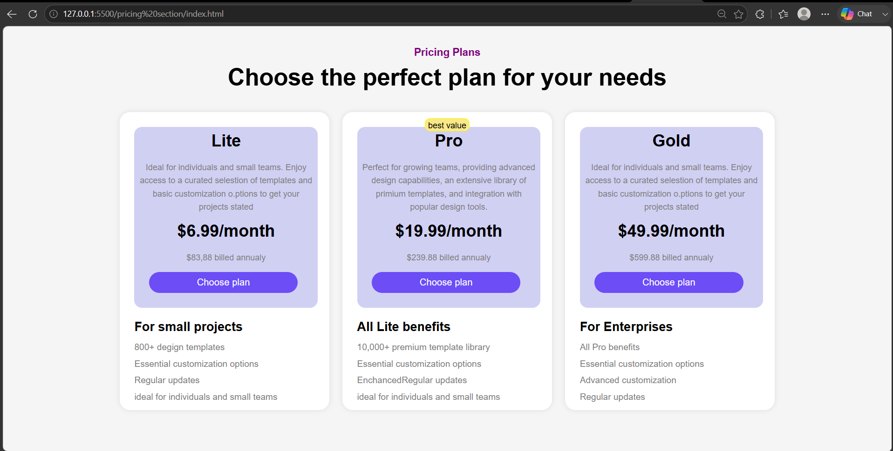

# Pricing Plans Website

A simple and responsive Pricing Plans webpage created using HTML and CSS.  
This project displays different subscription plans with clean UI cards and modern button styling.

## Features

- Responsive pricing cards layout
- Modern and clean UI design
- Highlighted "Best Value" plan
- Gradient buttons
- Simple HTML & CSS project
- Beginner-friendly code structure

## Technologies Used

- HTML5
- CSS3
## Screenshot

